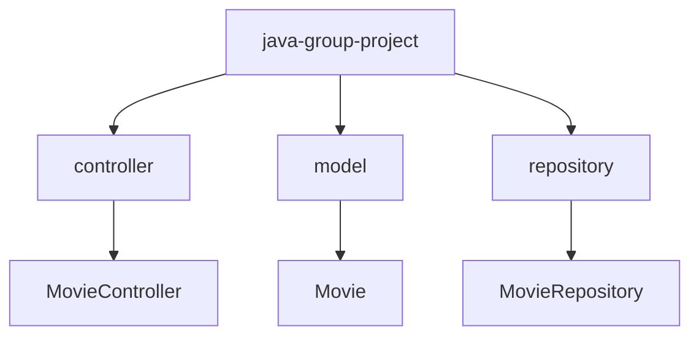
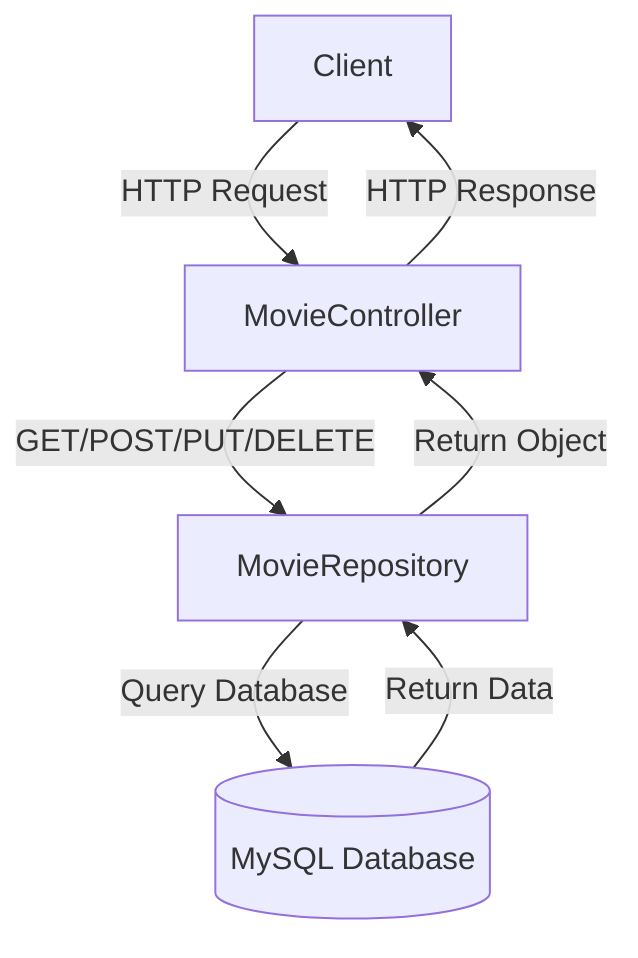
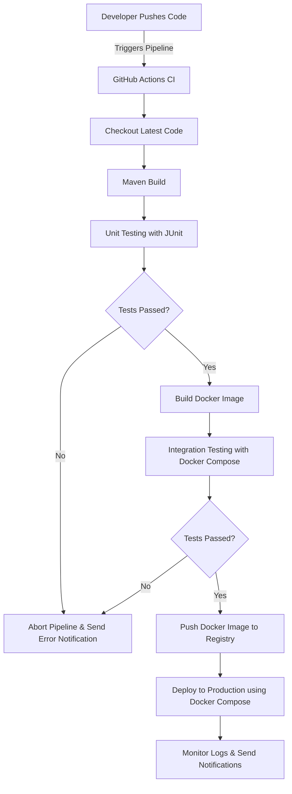

#### java group project - Team Json

# CineLog: A Movie Tracker System :movie_camera: :film_strip:

## Project Overview :clapper:

The **CineLog** is a Spring Boot application designed to help users track their favorite movies.
It allows users to perform actions such as adding new movies, viewing their movie collection, and tracking details
about each movie (e.g., title, personal review of each film, personal rating and date added).

## Application Requirements (Must Haves)

- A system that allows users to manage a collection of movies.
- Users can add, view, update, and delete movies from their collection.
- Each movie will have attributes such as:
    - Movie title
    - Personal review
    - Date added movie to collection (DB)
    - Star Rating 
- Data is stored in a MySQL database, and the application provides REST endpoints to interact with this data.

## Features :sparkles:
- RESTful API with CRUD operations for movie tracking.
- OpenAPI specification for API documentation.
- Docker containerization for ease of deployment.
- Integration with MySQL database.
- Logging and Exception handling.

## How We Have Achieved This

1. **Spring Boot Application**: A Spring Boot application was created  using the Spring Initializr to generate the necessary project structure.
2. **REST Endpoints**: We implemented RESTful endpoints to perform CRUD operations (Create, Read, Update, Delete) on movie data.
3. **Database Integration**: MySQL was used as the database for storing movie information. Spring Data JPA was used to
manage the interactions between the application and the database.
4. **Unit Testing**:  JUnit was used for unit testing and Mockito to mock external dependencies.
5. **Exception Handling**: Implemented appropriate exception handling using custom exceptions and Spring's global
exception handling features.
6. **Docker**: The application is containerized using Docker. We have created a Dockerfile and Docker Compose file for 
easier deployment and scalability.
7. **Logging**: We used SLF4J for logging throughout the application.

## Manual Test Plan: :clipboard:

1. **Add a Movie**
- Input valid movie details (title, review, date added and star(s).
- Verify the movie is saved correctly in the database.

2. **View Movies**
- Retrieve a list of movies and check if the information is correct.

3. **Update a Movie**
- Edit movie details and ensure the changes are reflected in the database.

4. **Delete a Movie**
- Delete a movie and verify it's removed from the database.

## Project Architecture:

This project follows a **Package by Layer** architecture, organizing the codebase by technical responsibilities rather
than by features. Each layer has a specific role:

### Package by Layer:

- **Controller**: `MovieController` handles incoming API requests and directing them to the appropriate service.
- **Repository**: `MovieRepository` interfaces with the database.
- **Model**: `Movie` represents the data model for the Movies table.

## RESTful Endpoints

1. **Add a Movie**
- `POST /movies`
- Request Body: JSON object with movie details.
- Response: Success message and the created movie object.

2. **Get All Movies**
- `GET /movies`
- Response: A list of all movies in the collection.

3. **Get A Movie by title**
- `GET /movies?=title`
- Request Query Parameters: Movie title as a query parameter.
- Response: The movie object that matches the provided title.

4. **Delete a Movie**
- `DELETE /movies/{id}`
- Request Parameters: Movie ID in the URL.
- Response: Success message confirming the movie has been deleted.

5. **Update a Movies**
- `PUT /movies/{id}`
- Request Parameters: Movie ID in the URL.
- Request Body: JSON object with updated movie details.
- Response: Success message and the updated movie object.




## Testing Subscription Controller MVC Test

Unit tests were written for the `MovieController` using Spring's Mvc framework in combination with Mockito. The aim was
to validate the functionality by simulating HTTP requests and checking the responses without running the full Spring
Boot application server.

### Key Libraries Used:
+ **JUnit 5**: Used for writing unit tests.
+ **Mockito**: Mocking dependencies for isolated tests.
+ **MockMvc**: For testing the controller layer without starting the full Spring application.


This file contains 14 tests:
+ updateMovie_ShouldUpdateMovie_when_MovieExists()
+ updateMovie_ShouldReturn404_when_MovieDoesNotExists()
+ updateMovie_ShouldReturn500_when_ExceptionIsThrown()
+ deleteMovie_ShouldDeleteMovie_when_MovieExists()
+ deleteMovie_ShouldReturn404_when_MovieDoesNotExist()
+ deleteMovie_ShouldReturn500_when_ExceptionThrown()
+ deleteMovie_ShouldReturn400_when_MovieIdIsNotAnInteger()
+ getAllMovies_ShouldReturnListOfMovies_WhenMoviesExist()
+ getAllMovies_ShouldReturnNoContent_WhenNoMoviesExist()
+ getAllMovies_ShouldReturnInternalServerError_WhenExceptionIsThrown()
+ when_addedMovie_ValidMovie()
+ when_addedMovie_InvalidTitle ()
+ when_addedMovie_InvalidStarRating ()
+ when_addedMovie_UnexpectedError ()

### OpenAPI Specification

The OpenAPI specification for the REST API can be accessed at:
- [**OpenAPI JSON Spec**](http://localhost:8080/v3/api-docs)
- [**Swagger UI**](http://localhost:8080/swagger-ui.html)

### Manual Testing of API
+ [**Postman**](https://www.postman.com/)
+ [**Insomnia**](https://insomnia.rest/)


## Database Setup

1. **MySQL Setup**:  
    - Use the MySQL script provided in `src/main/resources/database/` to set up the database.

2. **JPA Entities**:  
   An entity class `Movie` was created that maps to the `movies` table in the database, and a repository interface
   `MovieRepository` to handle CRUD operations.

## Running Instructions

#### **Prerequisites**:
- Java 21
- IntelliJ Idea (IDE)
- MySQL DBeaver or WorkBench
- Docker Desktop 

#### **Steps**:
- Clone the repository.
- Set up the database using the MySQL script provided.
- Run the application using `./mvnw spring-boot:run` in terminal or run in IntelliJ
- Access the application at `http://localhost:8080`.

## Editing Environment Configuration
To edit database settings, modify the `.env` file with your credentials:

#### **Example .env file:**

````
SPRING_DATASOURCE_URL= url
SPRING_DATASOURCE_USERNAME= username
SPRING_DATASOURCE_PASSWORD= password

````

## Docker Setup :whale:
### Understanding the Docker Compose Configuration:
This project uses Docker Compose to run the following services:

1. App (Spring Boot Application): Runs the your-app-name.jar inside a Docker container.
2. MySQL Database: Runs MySQL 8.0 and initializes the MovieTrackerDB database.

The `src/main/resources/database/` directory contains SQL scripts that will automatically execute when the MySQL container is created. Ensure that all initialization SQL files (such as table schemas and seed data) are placed inside this directory.

### Using the Dockerfile

The Dockerfile is used to build a Docker image of the Spring Boot application:

- It copies the `target/your-app-name.jar` file into the Docker container.
- The application runs on port `8080`.

The `docker-compose.yml` file configures both the Spring Boot application and the MySQL database to run together and sets up environment variables for the database configuration.

Once the application is running, you can interact with it using HTTP requests.

## Running the Application with Docker 
This section demonstrates how to connect the `java-group-project` application to a MySQL database using Docker. 
The CineLog application will communicate with the database, and you can test its endpoints in Postman.

**The process consists of three parts:**

1. **Creating a MySQL Image**
2. **Creating an Image for the CineLog Application**
3. **Running the `docker-compose.yml` file** to allow both services to communicate.

### Step 1: Create a MySQL Image

Download the MySQL image using Docker Desktop or the terminal:

````
docker pull mysql
````
### Step 2: Create an Image for the CineLog Application
Create the JAR file for your application in IntelliJ through the maven tab, under the LifeCycle directory execute `clean`
then `package`. This will generate a JAR file for your Spring Boot application in the `target/` directory.

Example :
````
java-group-project-0.0.1-SNAPSHOT.jar
````
If everything is correct, the program should run, and you’ll be able to access your endpoints through a browser or
Postman without needing to run the program from IntelliJ. Since you're now running it from the executable file, 
once you're done testing, you can safely close it.

### Step 3: Create Dockerfile
In the root directory of the project, create a `Dockerfile`:

```
 FROM eclipse-temurin:21-jdk     # Adujust if usuing java 22 (or whatever you are using)
 WORKDIR /src
 COPY target/java-group-project-0.0.1-SNAPSHOT.jar /src/java-group-project.jar
 EXPOSE 8080
 ENTRYPOINT ["java", "-jar", "java-group-project.jar"]
```
### Step 4: Build the Docker Image
To build the Docker image, run the following command:

````
docker build -t java-group-project
````
### Step 5: Create the `docker-compose.yml` File
Create a `docker-compose.yml` file in the root directory of your project:

```
services:
db:
image: mysql:latest
ports:
- "3306:3306"  # Maps port 3306 on the host to port 3306 in the container, allowing external access to the MySQL server.
environment:
MYSQL_DATABASE: MovieTrackerDB  # Sets the name of the default database that will be created.
MYSQL_ROOT_PASSWORD: ${SPRING_DATASOURCE_PASSWORD}  
volumes:
- /YOUR COMPUTERS DIRECT FILE PATH/Desktop/java-group-project/src/main/resources/database:/docker-entrypoint-initdb.d

java-group-project:
image: INSERT IMAGE CODE FROM DOCKER HERE  # Uses the image for the Spring Boot application.
depends_on:
- db  # Ensures that the database service is started before this application.
ports:
- "8080:8080"  # Maps port 8080 on the host to port 8080 in the container for the Spring Boot application.
environment:
SPRING_DATASOURCE_URL: jdbc:mysql://db:3306/MovieTrackerDB  # Specifies the JDBC URL to connect to the MySQL database running in the 'db' container.
SPRING_DATASOURCE_DRIVER_CLASS_NAME: com.mysql.cj.jdbc.Driver  # Sets the MySQL JDBC driver class.
SPRING_DATASOURCE_USERNAME: ${SPRING_DATASOURCE_USERNAME}  
SPRING_DATASOURCE_PASSWORD: ${SPRING_DATASOURCE_PASSWORD}  
```
This file sets up both the MySQL and Spring Boot application containers and ensures that they communicate with each other.

### Step 6:  Start the Application with Docker Compose
Run the Spring Boot app and MySQL database using Docker Compose. The following command builds the Docker 
image and starts both services:
````
docker-compose up 
````

### Step 7:  Access the Application
Once the containers are up, the application will be available at:
+ **Application**: `http://localhost:8080`
+ **MySQL Database**: `localhost:3306`

If you want to check MySQL via a MySQL client or use admin tools
like MySQL Workbench, connect to localhost:3306 with the credentials:

+ Username: root
+ Password: yourpassword


### Step 8:  Stopping the Application
When you're done, stop the containers using:

```
docker-compose down
```

### Step 9:  Rebuilding the Containers
If you've made changes to your code or Dockerfile, rebuild the containers:

````
docker-compose up --build
````


## Deployment Plan



1. **Continuous Integration**:
- GitHub Actions will be used for continuous integration, with stages for building, testing, and deploying the application.

2. **Docker**:
- The application is containerized using Docker. The `Dockerfile` and `docker-compose.yml` are provided to run
  the application alongside a MySQL container.

3. **Pipeline**:
- **Stage 1**: Build and test the application.
- **Stage 2**: Build Docker image.
- **Stage 3**: Deploy the application using Docker Compose.
